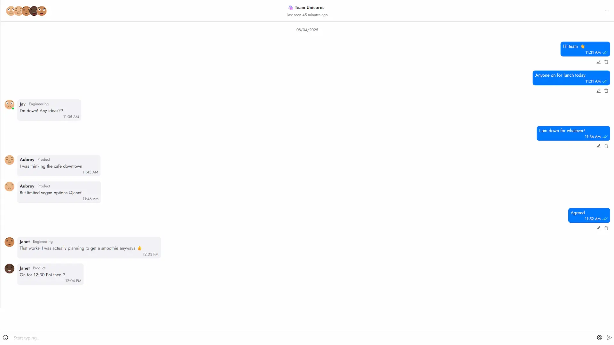
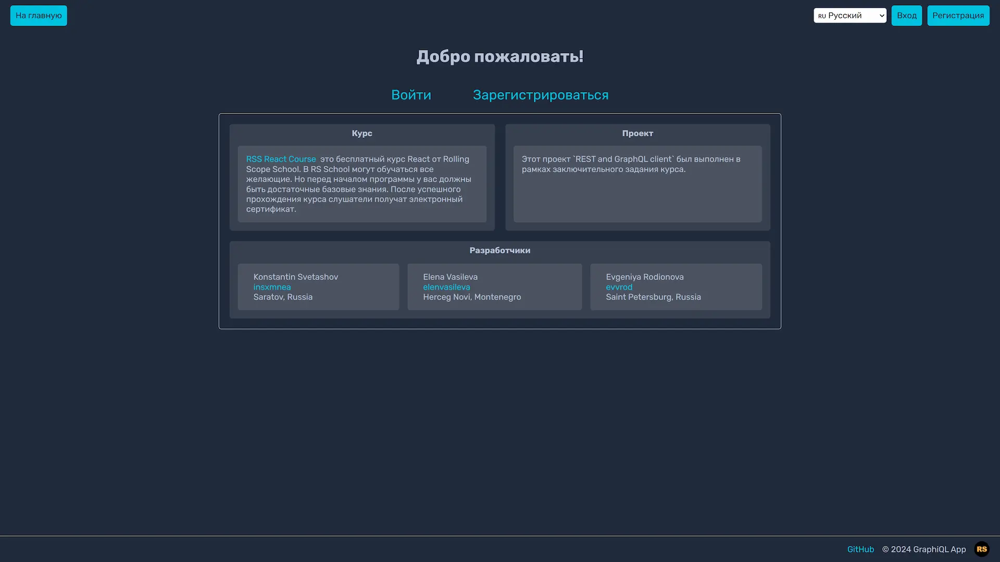
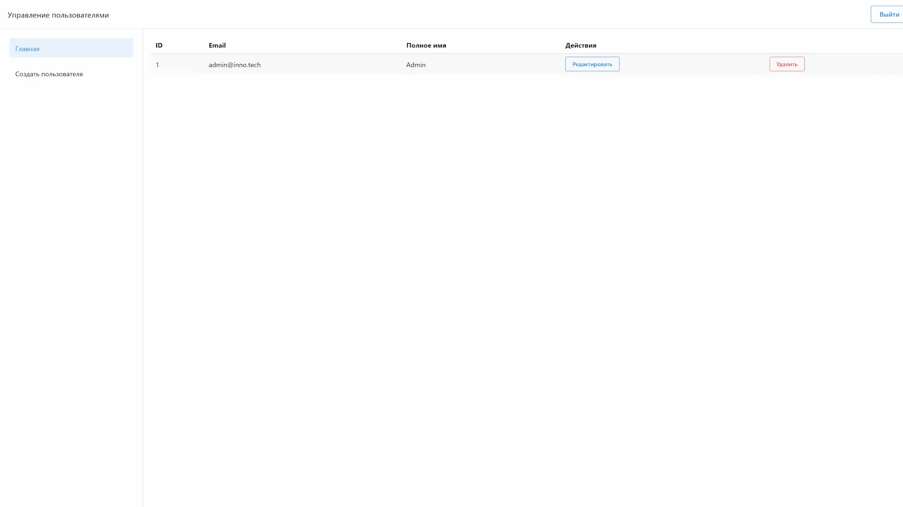
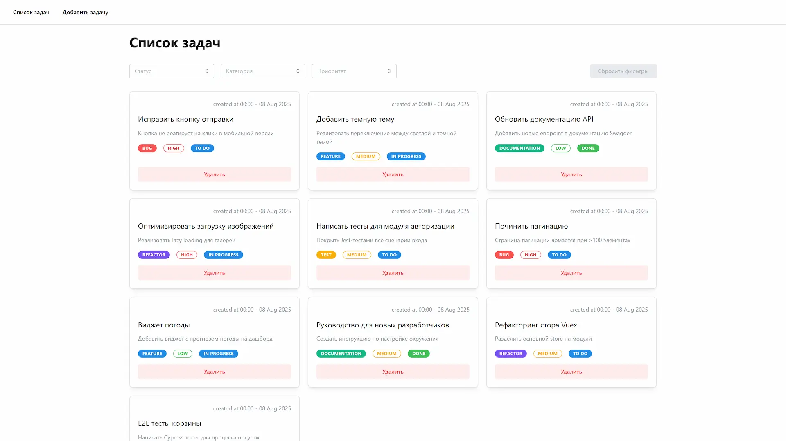
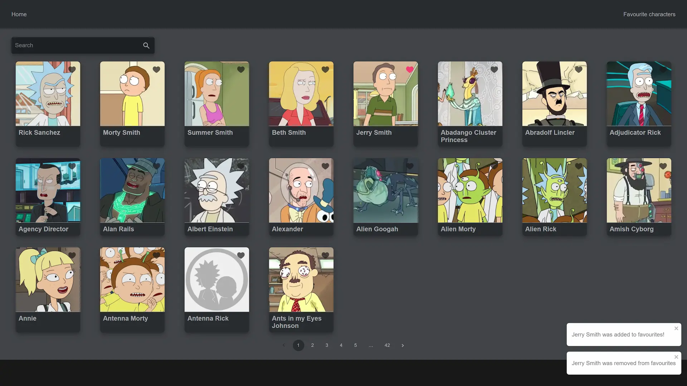
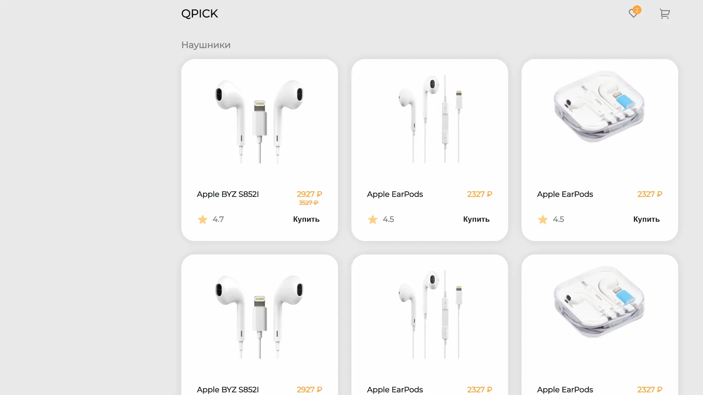
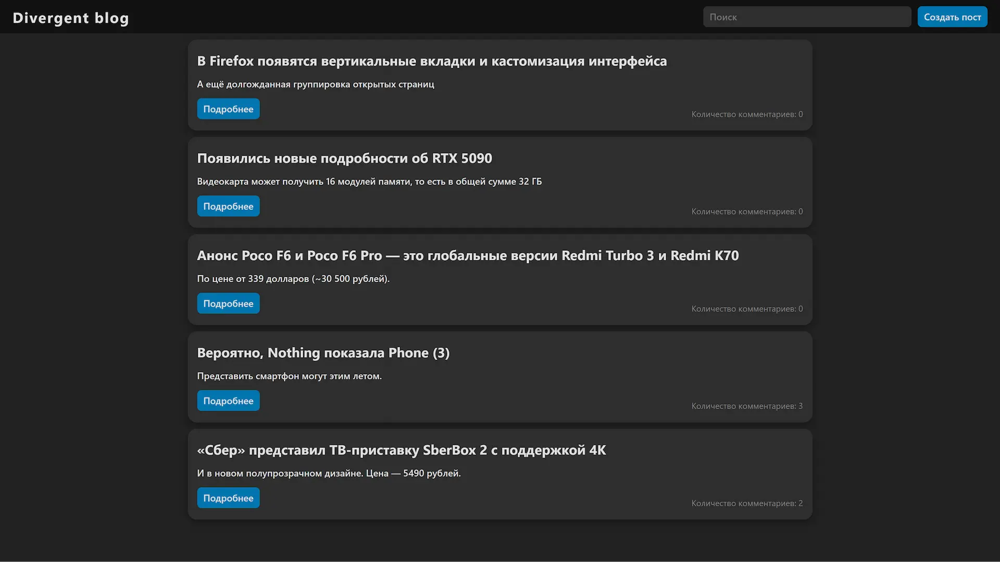
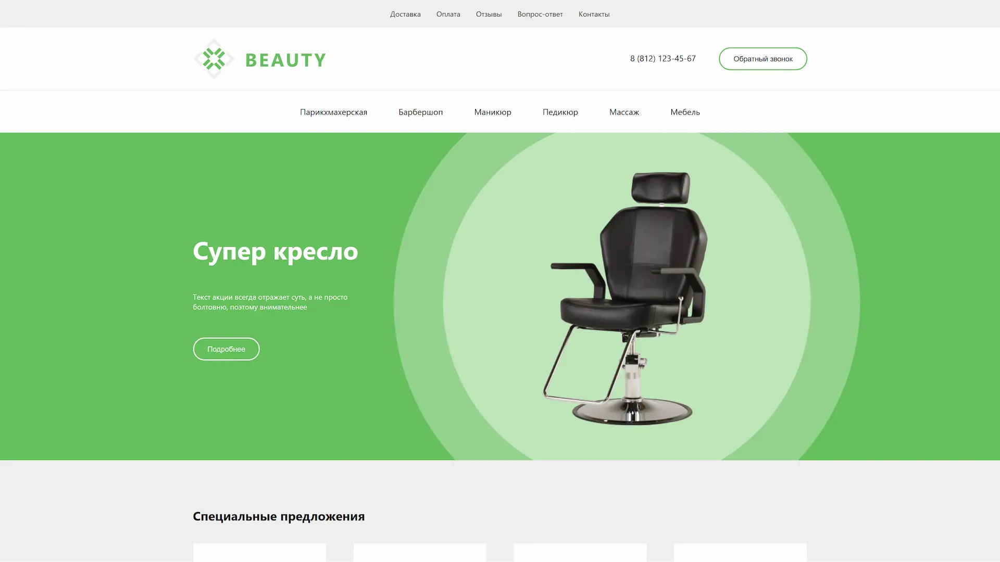
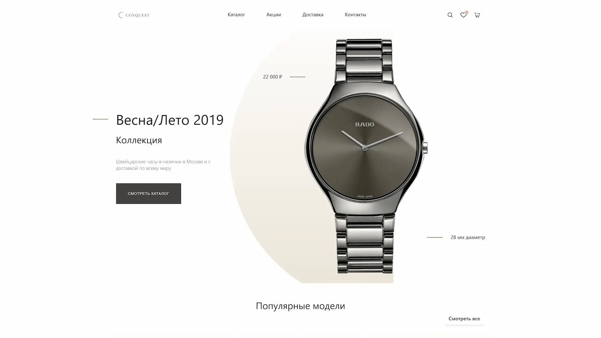
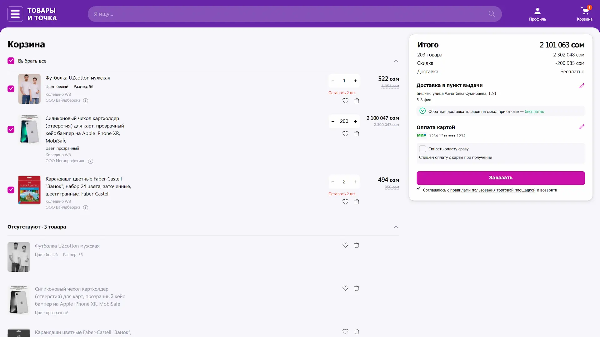

 
  <picture>
    <source media="(prefers-color-scheme: dark)" srcset="https://github-readme-stats.vercel.app/api?username=insxmnea&show_icons=true&theme=nord&hide_border=true">
    
  </picture>
  <picture>
    <source media="(prefers-color-scheme: dark)" srcset="https://github-readme-stats.vercel.app/api/top-langs?username=insxmnea&layout=compact&langs_count=8&card_width=320&theme=nord&hide_border=true">
    
  </picture>

<h2>Contacts</h2>

  
  

<h2>Projects</h2>

  

  
  
  

  
  
  
  
  
  

  
  
  

<h2>Education</h2>

- 🎓 Bachelor degree in Information systems and technologies - [Yuri Gagarin State Technical University of Saratov](https://www.sstu.ru/)
- 🎓 Master's degree in Information systems and technologies - [Yuri Gagarin State Technical University of Saratov](https://www.sstu.ru/)
- 📜 [JS / Front-end Course](https://rs.school/courses/javascript)
- 📜 [React Course](https://rs.school/courses/reactjs)

<h2>Sertifications</h2>

- [Web development for beginners: HTML and CSS](https://stepik.org/cert/289886?lang=en)
- [THE ROLLING SCOPES SCHOOL REACT 2024 Q3 (REACT)](https://app.rs.school/certificate/riyrdlzi)
- [T1. Frontend Development (JS+React)](https://davtb-teachbase.api.eric.s3storage.ru/system/coursestat/116770/cert/164c695e20b12150fd484cf0ab7a999e.pdf)

<h2>Honors</h2>

- [LeetCode](https://leetcode.com/u/insxmnea/)
- [HackerRank](https://www.hackerrank.com/profile/kostya_svetasho1)
- [Codewars](https://www.codewars.com/users/insxmnea)

